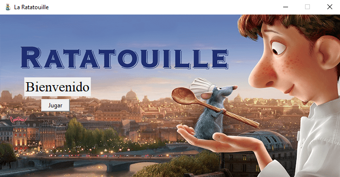
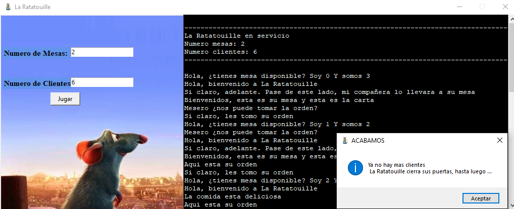
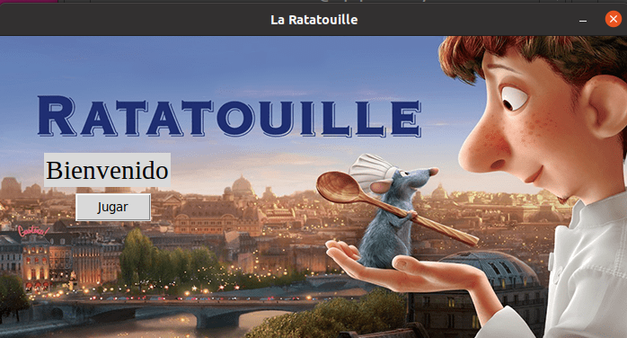
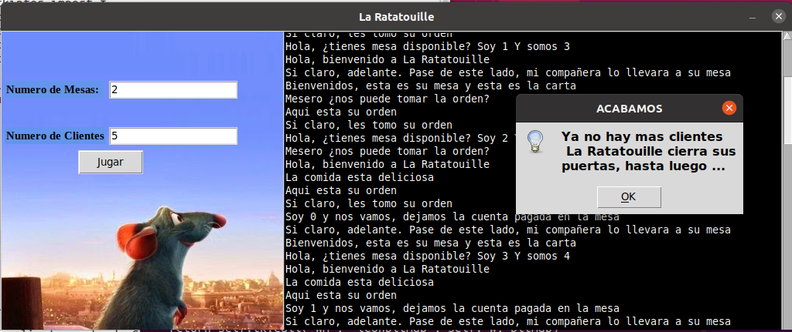

# Proyecto2: _Una situación cotidiana paralelizable_ 🚦🕛
---

Los eventos en el mundo en que vivimos se producen de forma masivamente paralela, por lo cual, la concurrencia puede presentarse en muchos casos, en ámbitos no necesariamente constreñidos al cómputo.

Por tanto, es de esperarse que –si existieran las primitivas de sincronización en el mundo real– podríamos aplicar lo estudiado en esta unidad a muchas otras situaciones.

Para este proyecto, se pide que:

Identifique un proceso de la vida real que presente características de concurrencia. Normalmente, cualquier proceso que presente eventos realizados por múltiples actores (sea como sea que los queramos entender)


## Identificación y descripción del problema

Mi idea para implementar fue hacer una simulación del servicio de un restaurante. 
Los comensales una vez asignados en una mesa se les tomará la orden para despues ser servida y degustada, una vez que haya terminado pagará y saldrá del inmueble.
 
* **1. Descripcion de la situacion modelada**
	En mi moleado, el servico del restaurante será un poco diferente ya que solo participará un único chef y mesero.

	Habrá dos hostess, la primera será la persona que está en la entrada y es la encargada de recibir y atender en primera instancia a los clientes que llegan al restaurante, si es posible les asigna una mesa disponible para que asi la segunda hostess sea la encargada de llevarlos a dicha mesa, si no es posible asignarles una mesa dejara esperando al cliente hasta que otro cliente salga.

	Una vez sentados el grupo de comensales tomarán un tiempo para prepar su orden, una vez lista avisaran a al mesero para que les tome dicha orden. Una vez tomada la orden por el mesero será él quien sea el encargado de llevar la orden al cocinero y a su vez el cocinero de tomar dicha orden para prepararla y avisar de regreso al mesero que la orden esta lista. El mesero llevará al cliente su orden lista para que asi pueda degustarla.

	Una vez que se hayan terminado de comer, dejaran pagada la cuenta  para despues proceder a retirarse del lugar.

* **2. ¿Dónde pueden verse las consecuencias nocivas de la concurrencia? ¿Qué eventos pueden ocurrir que queramos controlar?**
	
	La primer consecuencia que puedo ver es en la entrada, puede haber mas de un cliente que quiera preguntar si hay lugar disponible al mismo tiempo.

* **3. ¿Hay eventos concurrentes para los cuales el ordenamiento relativo no resulta importante?**
	
	No hay ninguno, ya que dependiendo de la llegada de cada evento es como será tratado.
	

### Mecanismos/Patrones 🚦

* Descripción de los mecanismos de sincronización empleados e interacción entre ellos (sea mediante los mecanismos de sincronización o de alguna otra manera):
 
	Para la resolucion del ejercicio utilice 4 patrones basados en semáforos: 
 
	* **Señalización**
```
	despertar_hostess = threading.Semaphore(0)
```
	El cliente avisa a la hostess principal que desea entrar, pregunta si tiene mesa disponible
```
	despertar_hostess2 = threading.Semaphore(0)
```
	La hostess principal avisa a la hostess2 que lleve al cliente a una mesa disponible
```
	ya_decidimos = threading.Semaphore(0)
```
	Los acompañantes avisan al cliente principal que ya pensaron que comer	
```
	tomar_orden =threading.Semaphore(0)
```
	Una vez queya todos decidieron que comer el cliente llama al mesero
```
	pedido_chef=threading.Semaphore(0)
```
	El mesero avisa al chef que hay pedido
```
	orden_lista= threading.Semaphore(0)
```
	El chef avisa al mesero que la oren esta lista
```
	poder_comer=threading.Semaphore(0)
```
	Wl mesero avisa al cliente que ya pueden empezar a comer puesto que ya trajo la orden
		
* **Mutex**
```
	mutex_cliente=threading.Semaphore(1)
```
	Con este mecanismo se logra evitar la concurrencia entre clientes ya que si no podria ver modificacion en la asignacion del total de acompañantes y por ende en la creacion de hilos.

* **Mutiplex**
```
	mesa_libre = threading.Semaphore(num_mesas)
```
	Con este multiplex se logra que solo haya cierto numero de mesas y sea el cliente quien vaya liberandolo cnforme sale del raestaurante para que la hostess principal pueda dar aceceso a un nuevo cliente

* **Barrera**
```
	barrera= threading.Barrier(lista)
```
	Con esta barrera se logra que una vez todos hayan ppensado en que comer uno de los hilos sea quien le avise al cliente

* **Lógica de operación:**
 
	* **Identificación del estado compartido (variables o estructuras globales):**

```
	lista1=[]
```
En esta lista se guarda el valor del total de acompañantes _(total_acompañantes)_, lo guarde en una lista para ocuaparlo en otra funcion fuera de cliente(id) y lo utlicie en la creacion de la barrea dado que si solo ponia _barrera= threading.Barrier(total_acompañantes)_ el valor de _(total_acompañantes)_ era igual a 0

```
	num_mesas
	n_clientes
```
Variables en las que estara guardado el valor que ingrese el usuario.


## Lenguaje y entorno 🖥️

Este programa fue implementado en Python3 Version 3.9.0.
Fue escrito  **Sublime Text 3**, asi como tambien compilado y ejecutado con el mismo gracias a la herramienta _SublimeREPL_ una vez ya instalado el Package Control propio de Python3

**¿Qué bibliotecas más allá de las estándar del lenguaje?**

Para la implemntacion de la interfaz se ocupo:
```
from tkinter import *
from tkinter import messagebox
```
Tkinter es un binding de la biblioteca gráfica Tcl/Tk para el lenguaje de programación Python. Se considera un estándar para la interfaz gráfica de usuario para Python y es el que viene por defecto con la instalación para Microsoft Windows

* **Sistemas Windows**
	Tambien fue ejecutado en sistemas Windows con la siguiente linea de comando en la terminal CMD _(si es que ya se tiene modificada la variable de entorno PATH)_:
```
	python Proyecto2.pyw
```
	_(Si no se tiene modificada la variable de entorno Path se necesita acceder a la ruta donde se tiene instalado Python y ejecutar desde ahi el archivo, que dicho archivo debe estar en la misma ruta.)_

* **Sistemas Linux**
	En sistemas Linux/Ubuntu tambien se puede ejecutar con la siguiente linea desde cualquier consola de comandos _(si ya se tiene instaldo Tkinter)_: 
```
python3 Proyecto2.pyw
```
	Si aún no se tiene instalado Tkinter basta con ingresar los siguientes comandos:
```
sudo apt-get install python3-tk (Versiones Python 3)
```
``` 
sudo apt-get install python-tk (Versiones Python 2.7)
```

## Capturas 🖥️

* **Sistemas Windows**
	*Ventana principal*


	*Ventana secundaria*



* **Sistema Linux/Ubuntu**
	*Ventana principal*


	*Ventana secundaria*


