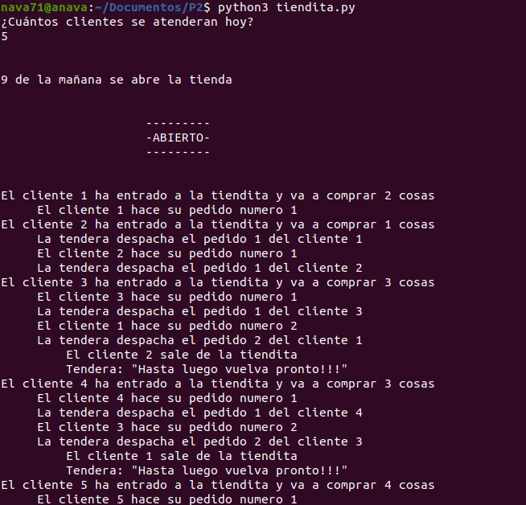
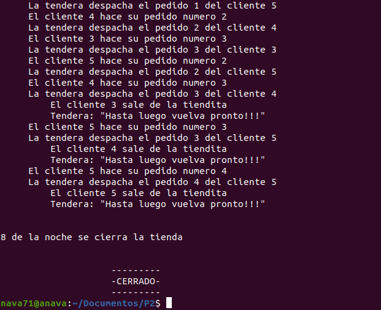

# Proyecto 2 Una situación cotidiana paralelizable # 

## Nava Escobar Jose Alfredo ##

Documentación del proyecto 2 de la materia de Sistemas Operativos

## Identificación y descripción del problema ##

Para este proyecto no se me ocurría que situación se podia representar, así que fuí a la tienda por algo que comer  mientras pensaba y me di cuenta que una tienda era un perfecto ejemplo. :smile:

En la tienda donde usualmente compro, la tendera despacha no precisamente en orden, es decir si alguien llega la atiende de inmediato pero si va a comprar más de un artículo y duda o piensa de más que más va a comprar, la tendera le dirá a la persona que llego despues "¿Qué va a llevar?" saltando al cliente que ya atendia para que pueda pensar y evitando que los siguientes clientes pierdan su tiempo.

Por motivo de la contingencia que vivimos actualmente la señora ha colocado una hoja que tiene escrito "Sólo se permiten 3 personas en la tienda y con cubrebocas puesto". Debido ha esto la clientela tendra que esperar si ya hay tres clientes dentro de la tiendita, aunque mientras yo era atendido y ya eramos 3 personas, un señor ingresó a la tienda. :worried:  

## Mecanismos para resolver el problema ##

Para la solución, se ejecuta un hilo para la tendera y uno para cada cliente, cada cliente es asociado a un identificador y tiene un máximo de artículos a comprar de 5, el proceso de pedidos por cliente se maneja en una lista.

Cada cliente puede hacer un pedido a la vez y la tendera puede pasar con otro cliente si es que hay más esperando en la tienda.

Los mecanismos empleados fueron: **mutex**, **multiplex** y **señalización**

Se crearón 4 semaforos los cuales permitén la cominicación entre la tendera y los clientes.

Debido a que solo puede haber 3 personas dentro de la tienda se empleó un multiplex, que controla que no entre más gente.

## Entorno de desarrollo ##

El programa fue escrito en el lenguaje de programación Python en su version 3.8.5. en un sistema operativo tipo ***UNIX***, Ubuntu 20.04.1 LTS para ser exactos.

Para la realizacón del programa se utilizarón las bibliotecas **threading**, **time** y **random**

    from threading import Semaphore, Thread
    from time import sleep 
    from random import randint

## Ejecución ##
Para ejecutar el programa basta con escribir en la terminal (estando en el directorio donde esta el documento claro):

		$python3 tiendita.py

## Ejemplo de una ejecución existosa ##
Pantallazos de ejecución exitosa

