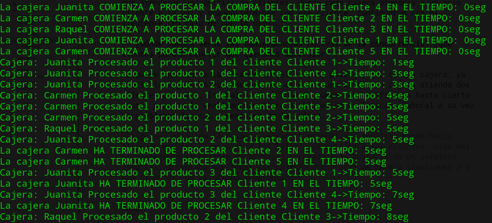
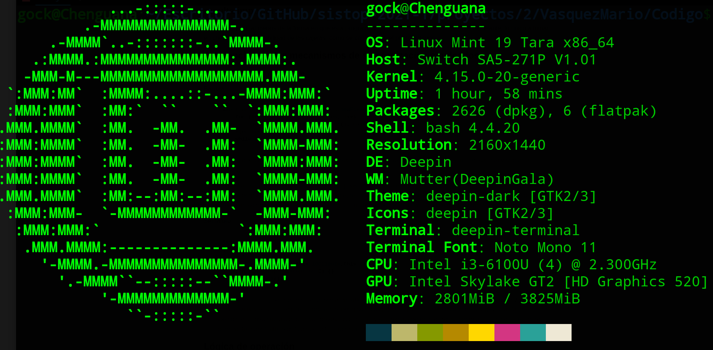
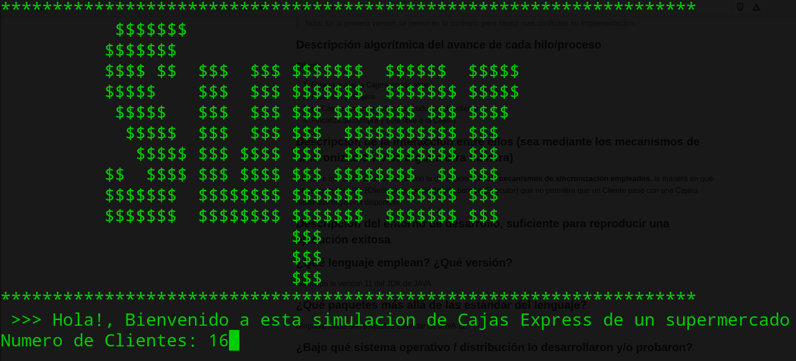
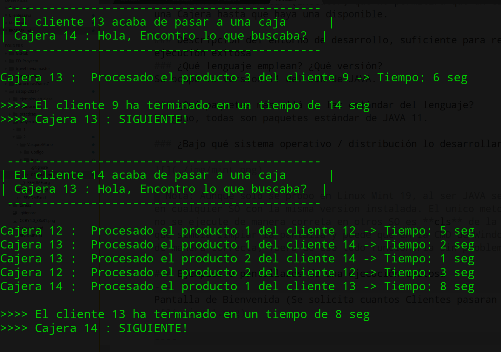
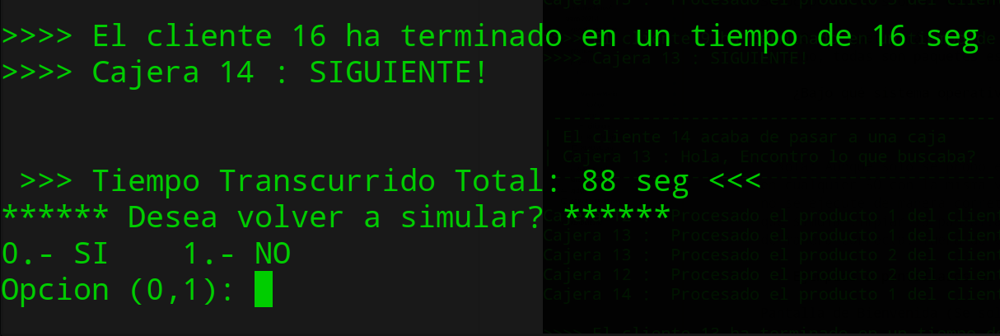
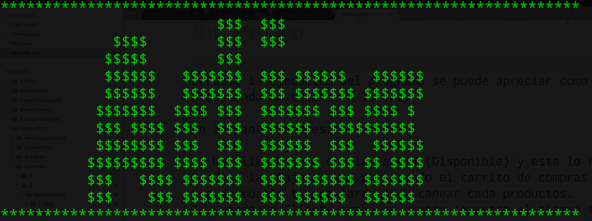

# :dollar: :dollar: :dollar: Cajas Express :dollar: :dollar: :dollar:

### Identificación y descripción del problema
Cuando uno va al supermercado por la despensa para la semana hay una zona por la cual estamos obligados a cruzar para abastecernos de los productos necesarios, y estamos hablando de la zona de cajas, donde un grupo de cajeras son las encargadas de hacer efectiva nuestra compra.
Para este proyecto nos enfocaremos exclusivamente en la zona de cajas express que la mayoria de los supermercados tienen. En esta zona tendremos 3 cajeras que atenderan una unifila de clientes, donde cada cajera atendera a un solo cliente a la vez y cuando terminen con ese cliente, continuaran con el siguiente (en caso de que lo haya).

### ¿Dónde pueden verse las consecuencias nocivas de la concurrencia? ¿Qué eventos pueden ocurrir que queramos controlar?
Se puede apreciar a la hora de que el cliente pase a pagar con la cajera, ya que si la cajera no esta desocupada esto provocaria que la cajera atienda dos clientes a la vez, lo cual a nivel computo puede ser beneficioso hasta cierto punto, pero en la realidad provocara problemas de explotacion laboral a su vez de problemas fisicos y mentales de la cajera.

> Nota: Algo asi paso con la primera version funcional que realice, donde habia planeado que las cajeras eran los hilos y compartian a los clientes, este mal planteamiento (o posible desarrollo) agregado a la ausencia de un semaforo como tal, provocaba que todas las cajeras atendieran de manera simultanea 2 o mas clientes, un resultado inapropiado.
> 
> Como se puede apreciar en la siguiente imagen:
> 

### ¿Hay eventos concurrentes para los cuales el ordenamiento relativo no resulta importante?
No hay ninguno, al menos de la forma en que esta programada la simulacion el orden no resulta importante, lo unico a tomar en cuenta es la disponibilidad de las cajeras, como se comento en el punto anterior.

### Descripción de los mecanismos de sincronización empleados
Se utilizo un semáforo y una barrera.

Barrera
```java
    ExecutorService ejecutor = Executors.newFixedThreadPool(3); 
        for (int i = 1; i <= numClientes; i++) 
            ejecutor.execute(new Clientes(i, cajeras));
        ejecutor.shutdown();
        while (!ejecutor.isTerminated());
```
> La barrera (Executor) lo que nos permite controlar el numero de cajeras que tendremos (en este caso 3) y segun la cantidad de clientes que el usuario proporciono.

> Se realizara un ciclo para que cada Cliente (hilo) pase con una Cajera (realice la accion de comprar), pero nuestra barrera no permitira que el siguiente hilo (Cliente) realice su tarea hasta que el semaforo de los clientes indiquen que acabaron de comprar. Todo esto se repetira hasta que no haya un Cliente y el Executor (barrera) se haya apagado.

Semaforo
```java
    try 
    {
      semaforo.acquire();
      this.cajeras.Comprar(this.idCliente,this.carroCompra); 
    } catch (InterruptedException E) {}
    semaforo.release();
```
> En cada Cliente (hilo) se implemento un semaforo que se le indica cuantas Cajeras hay disponibles y cada vez que el hilo inicie su proceso, su semaforo adquiere el permiso (acquire) de comprar, en pocas palabras si hay una Cajera disponible este procede a comprar sus productos con ella, y cuando acaba de realizar su compra el Cliente (hilo) libera el permiso (release), que significa que la Cajera esta libre.

### Lógica de operación
---

### Identificación del estado compartido (variables o estructuras globales)
Las estructuras que se comparten son los objetos cajeras, ya que cada Cliente (hilo) ocupara procedera a usar su metodo de comprar.

> Nota: En la primera version se penso en lo contrario pero causo mas conflictos su implementacion.

### Descripción algorítmica del avance de cada hilo/proceso

**Cliente**

1. Espera a que la Cajera quede libre
2. Pasa con la Cajera
3. La Cajera escanea todos los productos del cliente
4. Fincaliza su compra y deja libre a la Cajera

### Descripción de la interacción entre ellos (sea mediante los mecanismos de sincronización o de alguna otra manera)
Como se menciono anteriormente con la descripcion de los **mecanismos de sincronización empleados**, la manera en que interactuan los hilos (Clientes) es mediante una barrear (Executor) que no permitira que un Cliente pase con una Cajera hasta que haya una disponible.

### Descripción del entorno de desarrollo, suficiente para reproducir una ejecución exitosa
---
### ¿Qué lenguaje emplean? ¿Qué versión?
Se ocupo la version 11 del JDK de JAVA.

### ¿Qué paquetes más allá de las estándar del lenguaje?
Ninguno, todas son paquetes estándar de JAVA 11. 

### ¿Bajo qué sistema operativo / distribución lo desarrollaron y/o probaron?



> Nota: Aunque solo se probo en Linux Mint 19, al ser JAVA se puede ejecutar en cualquier SO con la misma version instalada. El unico metodo que puede que no se ejecute de manera correta en otros SO es **cls** de la clase Main, ya que simula limpiar la pantalla y puede que en la CMD de Windows no lo simule de manera correcta, fuera de eso todo funcionaria sin problema.

### Ejemplos o pantallazos de una ejecución exitosa
---
Pantalla de Bienvenida (Se solicita cuantos Clientes pasaran a cajas)


---
Durante la ejecucion del programa se puede apreciar como cada cajera va procesando un cliente a la vez.

En la pantalla muestra:

1. Un Cliente pasa con la Cajera (Disponible) y esta lo recibe
2. Como las Cajeras van procesando el carrito de compras del clientes, a su vez de cuanto tiempo tarda en escanear cada productos.
3. Cuando un Cliente acaba su compra (muestra el tiempo total que tardo la Cajera en procesar toda su compra) y como anuncia la Cajera que esta disponible para atender al siguiente cliente. 

> Nota: Los id's de las Cajeras son los id's de los Hilos que corren la tarea actual (Asi que pueden cambiar con cada ejecucion).



---
Cuando ya no hay Clientes que atender se muestra en pantalla:

1. Tiempo Total desde que paso el primer Cliente.
2. Si se quiere ejecutar nuevamente el programa o si se quiere finalizar su ejecucion.



---
En caso de elegir repetir el programa, se volvera a mostrar en pantalla el mensaje de bienvenida y a solicitar la cantidad de Clientes.

Pero si se escogio terminar el programa, se mostrar el siguiente mensaje en notificacion que se acabo la ejecucion del programa (simulacion).

