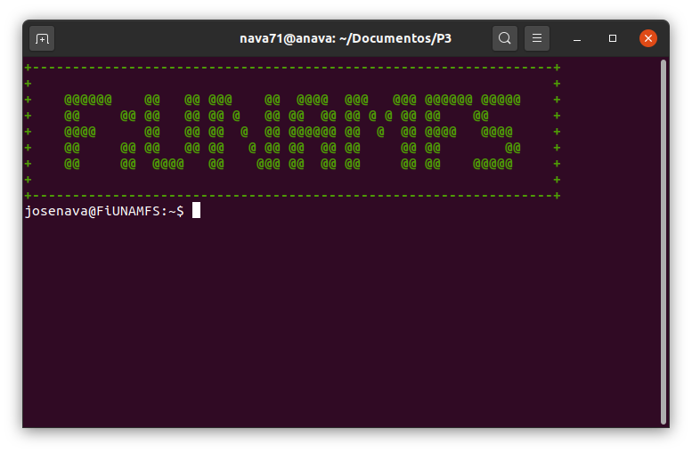
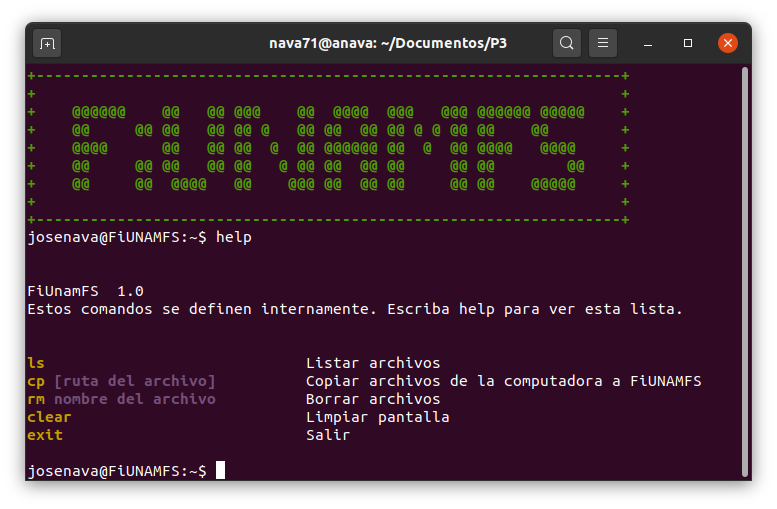

# Proyecto 3 (Micro) sistema de archivos # 

## Nava Escobar Jose Alfredo ##

Documentación del proyecto 3 de la materia de Sistemas Operativos

## Descripción del proyecto ##

El desarrollo del proyecto busca implementar una serie de operaciones en un sistema de archivos  el cual lleva por nombre **FiUnamFs**.

Las operaciones son: 
1. Listar los contenidos del directorio
2. Copiar uno de los archivos de dentro de FiUnamFs hacia nuestro sistema :x:
3. Copiar un archivo de nuestra computadora hacia  FiUnamFs :x:
4. Eliminar un archivo de FiUnamFs
5. Desfragmentar a FiUnamFs :x:

## Funcionamiento del programa ##

El programa inicia con la pantalla principal del sistema de archivos:

Como si se tratara de la terminal de un sistema UNIX las operaciones antes mencionadas se ejecutan mediante el ingreso de comandos (los comandos tienen el mismo nombre que los comandos tipicos de un sistema UNIX como Ubuntu)
Si se quisiera consultar los comandos que admite el programa se puede solicitar ayuda mediante el comando **help** el cual desplegara la siguiente información.

El manejo del programa quedara en función de los comandos ingresados y al salir del sistema de archivos, se regresara a nuestro sistema principal.

## Entorno de desarrollo ##

El programa fue escrito en el lenguaje de programación Python en su version 3.8.5. en un sistema operativo tipo ***UNIX***, Ubuntu 20.04.1 LTS para ser exactos.

Para la realizacón del programa se utilizarón las bibliotecas **struct** y  **os**

    import struct
	import os, os.path

## Ejecución ##
Para ejecutar el programa basta con escribir en la terminal (estando en el directorio donde esta el documento claro):

		$python3 fsfiunam.py